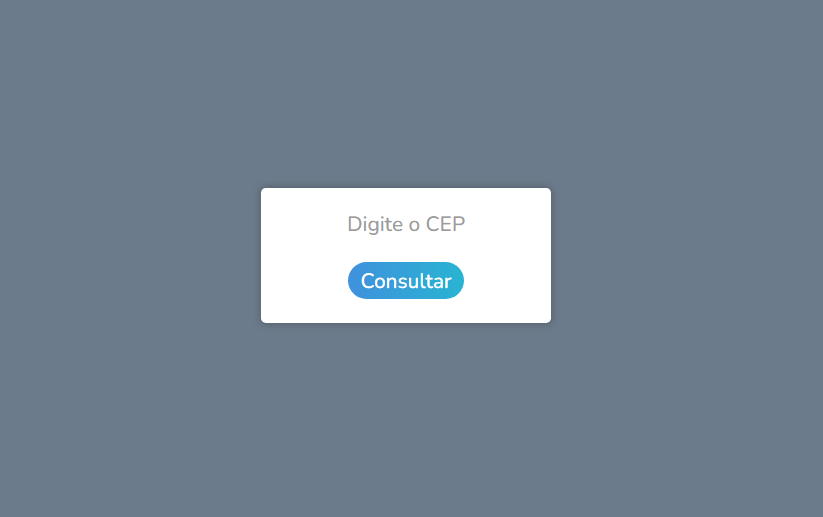

<h1 align="center">
  💻 Consultar CEP
</h1>

<h4 align="center"><a href="https://lucasgabriell97.github.io/zip-code-consult/">Clique para visitar o projeto</a></h4>

## 📚 Sobre o projeto

Depois de vim estudando sobre API no Frontend, resolvi fazer esse pequeno projeto para consulta de endereço usando a API viaCEP. Após inserir um CEP válido, o usuário consegue obter informações como logradouro, bairro, cidade e estado.

## 💼 Tecnologias utilizadas

- HTML;
- CSS;
- JavaScript;
- Axios;
